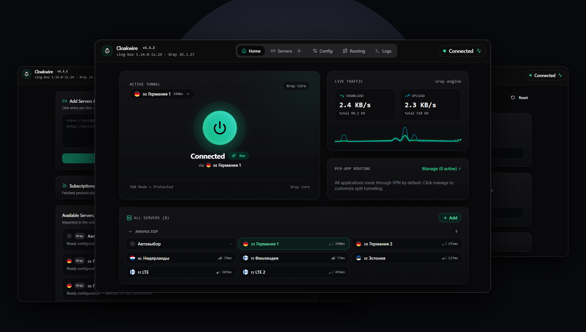
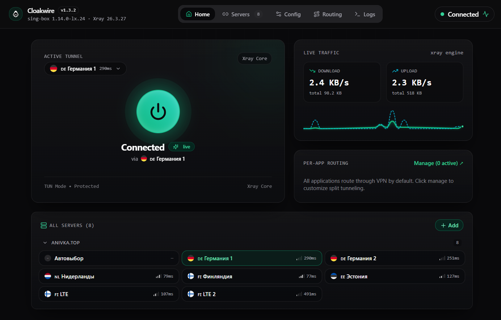

<div align="center">


# Cloakwire

**Next-generation, privacy-first VPN client with dual sing-box + Xray engines and a hyper-responsive Linear Bento UI.**

Cross-platform · Lightweight Rust/Tauri Core · VLESS Reality / Hysteria 2 / TUIC · 0 Logs · 100% Open Source

<br/>

[](https://github.com/markwhite7881-cpu/cloakwire/releases/latest)
[](https://github.com/markwhite7881-cpu/cloakwire/releases/latest)
[](https://github.com/markwhite7881-cpu/cloakwire/releases/latest)
[](LICENSE)

<br/>

**[ 🇷🇺 Читать документацию на русском языке (Russian README) ](README.ru.md)**

<br/>



</div>

---

## ⚡ Direct Downloads (v1.4.1)

| Platform | Recommended Installer | Alternative Package | Architecture |
|---|---|---|---|
| 🪟 **Windows** | [⬇️ **Download .exe** (NSIS)](https://github.com/markwhite7881-cpu/cloakwire/releases/latest/download/Cloakwire_1.4.1_x64-setup.exe) | [⬇️ **Download .msi**](https://github.com/markwhite7881-cpu/cloakwire/releases/latest/download/Cloakwire_1.4.1_x64_en-US.msi) | x64 (Intel / AMD) |
| 🍏 **macOS Apple Silicon** | [⬇️ **Download .dmg**](https://github.com/markwhite7881-cpu/cloakwire/releases/latest/download/Cloakwire_1.4.1_aarch64.dmg) | [⬇️ **Download .app.zip**](https://github.com/markwhite7881-cpu/cloakwire/releases/latest/download/Cloakwire_1.4.1_aarch64.app.zip) | M1 / M2 / M3 / M4 |
| 🍏 **macOS Intel** | [⬇️ **Download .dmg**](https://github.com/markwhite7881-cpu/cloakwire/releases/latest/download/Cloakwire_1.4.1_x64.dmg) | [⬇️ **Download .app.zip**](https://github.com/markwhite7881-cpu/cloakwire/releases/latest/download/Cloakwire_1.4.1_x64.app.zip) | x86_64 |
| 🐧 **Linux** | [⬇️ **Download .deb** (Ubuntu / Debian)](https://github.com/markwhite7881-cpu/cloakwire/releases/latest/download/Cloakwire_1.4.1_amd64.deb) | [⬇️ **Download .AppImage** (Portable)](https://github.com/markwhite7881-cpu/cloakwire/releases/latest/download/Cloakwire_1.4.1_amd64.AppImage) | x86_64 |
| 🤖 **Android** | [⬇️ **Download .apk**](https://github.com/markwhite7881-cpu/cloakwire/releases/latest/download/Cloakwire_1.4.1_arm64-v8a.apk) | — | arm64-v8a |

> 🔒 Every desktop release binary is cryptographically signed with **Minisign** (`.sig`) and verified with SHA-256 checksums in [`SHA256SUMS.txt`](https://github.com/markwhite7881-cpu/cloakwire/releases/latest/download/SHA256SUMS.txt).

---

## 🚀 Quick Start

### 1. Download & Install
Download the installer or portable bundle for your operating system from the table above.

### 2. Import Your Subscription or Node
Click **Add Server** or paste your connection link (`vless://`, `vmess://`, `ss://`, `trojan://`, `hy2://`, `tuic://`, `wireguard://`, or any Base64 / Clash subscription URL). The clipboard helper will detect compatible links automatically.

### 3. Connect
Tap the central **Power Orb**. Cloakwire establishes the encrypted proxy tunnel with real-time latency probing and automatic DNS hijacking prevention.

---

## 🛡️ Trust, Privacy & Verification

### Why do Windows SmartScreen or macOS Gatekeeper show a warning?
Cloakwire is **100% free and open-source software**. We do not purchase commercial code signing certificates (which cost $400+/year for Microsoft EV Authenticode and $99/year for Apple Developer).
- **Windows SmartScreen**: Click **"More info"** → **"Run anyway"**.
- **macOS Gatekeeper**: Right-click `Cloakwire.app` → select **"Open"** (or allow under *System Settings → Privacy & Security*).
- **Verification**: All desktop packages are cryptographically signed with our public Minisign key (`.sig` files available on GitHub Releases) and listed with SHA-256 hashes in `SHA256SUMS.txt`. All build scripts and source code are open for inspection in this repository.

```powershell
# Verify Windows installer checksum:
(Get-FileHash Cloakwire_1.4.1_x64-setup.exe -Algorithm SHA256).Hash.ToLower()
```

### Privacy Guarantees
- **Zero Telemetry**: No tracking, no analytical beacons, no crash dump reporting, zero external network requests outside user-configured proxies.
- **Encrypted DNS Routing**: In proxy mode, domain lookups are routed through encrypted DNS-over-HTTPS (`dns.google`) over the proxy tunnel, preventing ISP domain interception and DNS poisoning.
- **Backend Subscription Processing**: Subscriptions and authentication tokens are fetched and decoded directly in the native Rust backend and isolated from the UI web layer.

---

## ⚔️ Architecture & Design Comparison

| Characteristic | Cloakwire | v2rayN | Clash Verge / Mihomo | Hiddify |
|---|---|---|---|---|
| **UI Framework** | **Linear Bento UI (React/Tailwind)** | Classic .NET / WinForms | Web/Electron | Flutter multi-platform |
| **Idle Memory (RAM)** | **~35 MB (Rust + OS Webview)** | ~120 MB (.NET runtime) | ~150 MB (Chromium helper) | ~100 MB (Flutter engine) |
| **Core Architecture** | **Dual sing-box + Xray (Auto-Fallback)** | Manual core selection | Mihomo (Clash Meta) | sing-box core |
| **Traffic Visualization** | **60 FPS Hardware Canvas Wave** | Numeric text counters | SVG/Canvas graph | Canvas graph |
| **Split Tunneling** | **1-Click "Apps via VPN" / "Apps Direct"** | Regex routing rules | YAML rule sets | Per-app picker |
| **Protocol Coverage** | **VLESS, VMess, Trojan, SS, Hysteria 2, TUIC** | Full protocol support | Protocol-dependent | Full protocol support |
| **Supported Platforms** | **Windows, macOS, Linux, Android** | Windows | Windows, macOS, Linux | Cross-platform |

---

## 🌟 Key Features

### 🎨 Linear Bento UI Design
A minimal, engineering-focused dark interface: high-contrast zinc palette, subtle emerald connection glow, real-time download and upload counters in KB/s, and a smooth 60 FPS live canvas traffic wave.

### 🧩 Intelligent Dual-Engine Architecture
- **sing-box (Default Engine)**: High-performance packet processing, low CPU overhead, system TUN mode, per-app routing, and native URL-test auto-migration.
- **Xray Core (Automatic Fallback)**: Automatically activates when importing specialized configurations requiring Xray-specific extensions without user friction.

### 🎯 Smart App Routing (Split Tunneling)
- **Apps via VPN**: Route specific applications (e.g. Telegram, Discord, Browser) through the encrypted tunnel while preserving maximum domestic connection speeds for everything else.
- **Apps Direct**: Send all system traffic through the VPN while keeping sensitive services (e.g. banking, local intranet) on direct unproxied connections.

### 🌐 Auto Country Detection & Latency Probing
- Detects ISO country flags (e.g. 🇳🇱 Netherlands, 🇩🇪 Germany, 🇪🇪 Estonia) from server names.
- Probes all nodes in parallel with TCP/HTTP latency tests to display accurate round-trip ping (ms).

---

## 📱 Screenshots

<div align="center">
  
  
</div>
<div align="center">
  
  
</div>

---

<details>
<summary><b>🔧 Technical Architecture & Protocols (Click to expand)</b></summary>

<br/>

### Supported Protocols

| Protocol | Transports & Features | Core Engine |
|---|---|---|
| **VLESS** | Reality, XTLS-Vision, WebSocket, gRPC, HTTPUpgrade, Splithttp | `sing-box` / `Xray` |
| **VMess** | TCP, WebSocket, gRPC, TLS | `sing-box` / `Xray` |
| **Trojan** | TLS, WebSocket, gRPC | `sing-box` / `Xray` |
| **Shadowsocks** | AEAD, 2022 (blake3, chacha20, aes-gcm) | `sing-box` / `Xray` |
| **Hysteria 2** | Port-hopping, Salamander obfuscation, BBR | `sing-box` |
| **TUIC** | QUIC, 0-RTT handshake, BBR congestion control | `sing-box` |
| **WireGuard / AWG** | Encrypted UDP tunnel | `sing-box` |

### Building from Source

**Prerequisites**:
- Node.js 20+ & npm
- Rust 1.80+ (`cargo`)
- Platform build dependencies:
  - **Windows**: Visual Studio 2022 C++ Build Tools, WiX Toolset v3, NSIS
  - **macOS**: Xcode Command Line Tools
  - **Linux**: `libwebkit2gtk-4.1-dev`, `build-essential`, `libayatana-appindicator3-dev`

```bash
# Clone the repository
git clone https://github.com/markwhite7881-cpu/cloakwire.git
cd cloakwire

# Install web dependencies
npm install

# Run in development mode
npm run tauri:dev

# Build production installer
npm run tauri:build
```

</details>

---

## 📄 License

Cloakwire is distributed under the **MIT License**. See [`LICENSE`](LICENSE) for details.
All bundled core engines (`sing-box`, `Xray-core`) belong to their respective copyright holders under GPL / MPL open-source licenses.