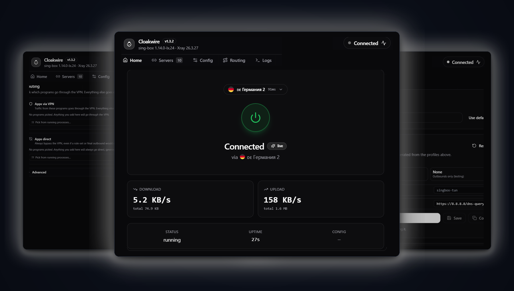
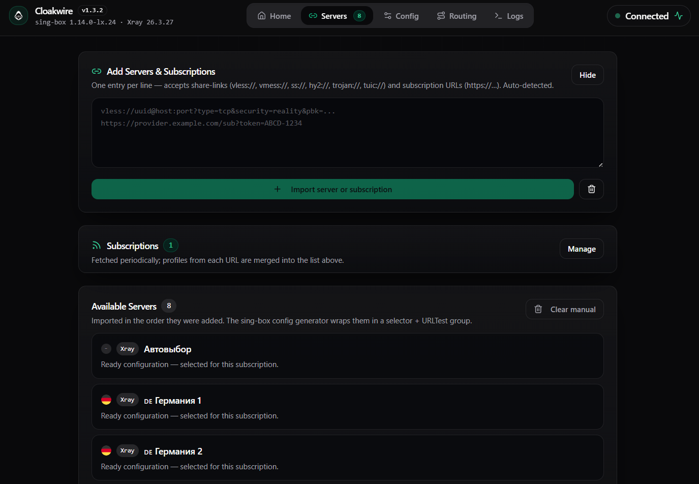
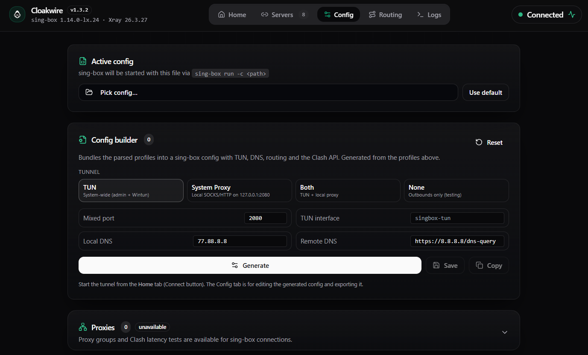
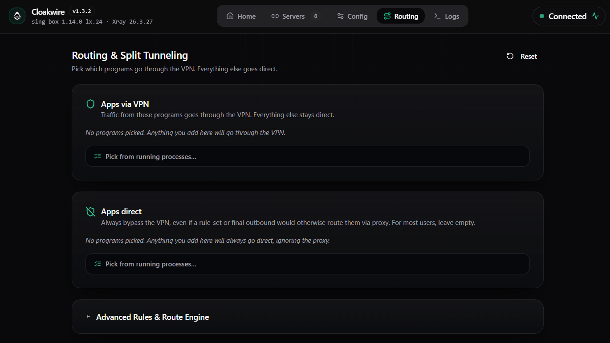

<div align="center">


# Cloakwire

**Privacy-first VPN-клиент для Windows, macOS, Linux и Android с двумя движками: sing-box и Xray.**

Tauri 2 + React + TypeScript.

[](https://github.com/markwhite7881-cpu/cloakwire/releases/latest)
[](https://github.com/markwhite7881-cpu/cloakwire/releases/latest)
[](LICENSE)
[](https://github.com/markwhite7881-cpu/cloakwire/stargazers)

<br/>



</div>

> 🇬🇧 **English version:** [README.en.md](README.en.md)

---

### ⚡ Быстрая загрузка актуальной версии (v1.4.0)

| Платформа | Основной установщик | Альтернативный пакет |
|---|---|---|
| 🪟 **Windows (x64)** | [⬇️ **Скачать .exe** (NSIS)](https://github.com/markwhite7881-cpu/cloakwire/releases/latest/download/Cloakwire_1.4.0_x64-setup.exe) | [⬇️ **Скачать .msi**](https://github.com/markwhite7881-cpu/cloakwire/releases/latest/download/Cloakwire_1.4.0_x64_en-US.msi) |
| 🍏 **macOS (Apple Silicon M1-M4)** | [⬇️ **Скачать .dmg** (aarch64)](https://github.com/markwhite7881-cpu/cloakwire/releases/latest/download/Cloakwire_1.4.0_aarch64.dmg) | [⬇️ **Скачать .app.zip**](https://github.com/markwhite7881-cpu/cloakwire/releases/latest/download/Cloakwire_1.4.0_aarch64.app.zip) |
| 🍏 **macOS (Intel)** | [⬇️ **Скачать .dmg** (x64)](https://github.com/markwhite7881-cpu/cloakwire/releases/latest/download/Cloakwire_1.4.0_x64.dmg) | [⬇️ **Скачать .app.zip**](https://github.com/markwhite7881-cpu/cloakwire/releases/latest/download/Cloakwire_1.4.0_x64.app.zip) |
| 🐧 **Linux (x64)** | [⬇️ **Скачать .deb** (Ubuntu / Debian)](https://github.com/markwhite7881-cpu/cloakwire/releases/latest/download/Cloakwire_1.4.0_amd64.deb) | [⬇️ **Скачать .AppImage**](https://github.com/markwhite7881-cpu/cloakwire/releases/latest/download/Cloakwire_1.4.0_amd64.AppImage) |
| 🤖 **Android** | [⬇️ **Скачать .apk** (arm64-v8a)](https://github.com/markwhite7881-cpu/cloakwire/releases/latest/download/Cloakwire_1.4.0_arm64-v8a.apk) | — |

---

## 🎯 Что это такое

**Cloakwire** — минималистичный кросс-платформенный VPN-клиент. Он принимает share-links и подписки, сохраняет конфигурации локально и запускает профиль в удобном интерфейсе без ручного редактирования JSON.

**sing-box — основной движок.** Используется на всех платформах для TUN, System Proxy, маршрутизации по приложениям, выбора прокси и встроенных проверок задержки.

**Xray — fallback по возможностям.** Если подписка содержит профиль, который безопаснее или корректнее исполнять через Xray, Cloakwire подготавливает и запускает его автоматически. На Home при этом сохраняется статус, выбранный сервер и live-метрики.

### Поддерживаемые протоколы

| Протокол | Транспорт и расширения | Движок |
|---|---|---|
| **VLESS** | Reality, XTLS-Vision, WebSocket, gRPC, HTTPUpgrade, Splithttp | `sing-box` / `Xray` |
| **VMess** | TCP, WebSocket, gRPC, TLS | `sing-box` / `Xray` |
| **Trojan** | TLS, WebSocket, gRPC | `sing-box` / `Xray` |
| **Shadowsocks** | AEAD, 2022 (blake3, chacha20, aes-gcm) | `sing-box` / `Xray` |
| **Hysteria 2** | Порт-хоппинг, обфускация salamander, BBR | `sing-box` |
| **TUIC** | QUIC, 0-RTT, BBR congestion control | `sing-box` |
| **WireGuard / AWG** | Защищенный UDP-туннель | `sing-box` |

---

## ✨ Возможности

| | |
|---|---|
| 🚀 **Быстрый старт** | Share-link или подписка → профиль готов к подключению |
| 🧩 **Два движка** | sing-box — основной на всех платформах; Xray — fallback для совместимых профилей |
| 🎯 **Per-app маршруты** | «Telegram через VPN, банк напрямую» — в одном интерфейсе |
| 🗂️ **Подписки без утечек** | Подписки разбираются в backend; URL и содержимое профилей не передаются WebView |
| 🧭 **Понятный Home** | Серверы одной подписки сгруппированы, названия провайдера используются как fallback |
| 🔄 **Безопасное переподключение** | При смене сервера или рабочих настроек активный VPN переподключается автоматически |
| 📈 **Live-статус** | Состояние соединения, графики трафика и информация о текущем движке |
| 🔐 **Подписанный апдейтер** | Встроенный манифест `latest.json` с minisign-подписями для desktop auto-update |
| 🔓 **Open Source** | MIT, без встроенной аналитики и телеметрии |

### Управляйте маршрутом, а не настройками сети

- **Apps via VPN.** Выберите браузер, игру, мессенджер или другое приложение — только их соединения пойдут через VPN-туннель. Остальной трафик продолжит работать напрямую.
- **Apps direct.** Направьте через VPN системный трафик и оставьте прямое соединение только для выбранных приложений — например, банковских клиентов или локальной сети.

---

## 📥 Подробная установка

Все файлы доступны на странице **[Releases](https://github.com/markwhite7881-cpu/cloakwire/releases/latest)**.

### Windows x64

| Файл | Описание |
|---|---|
| `Cloakwire_1.3.2_x64-setup.exe` | NSIS-инсталлятор (рекомендуется) |
| `Cloakwire_1.3.2_x64_en-US.msi` | MSI-пакет для корпоративного развёртывания |

> ℹ️ Windows-инсталляторы защищены встроенной подписью Minisign для безопасных автообновлений. Из-за отсутствия платного сертификата Authenticode фильтр Windows SmartScreen при первой установке может запросить подтверждение («Подробнее» → «Выполнить в любом случае»).

### macOS

| Архитектура | Файлы |
|---|---|
| Apple Silicon (M1/M2/M3/M4) | `Cloakwire_1.3.2_aarch64.dmg` или `Cloakwire_1.3.2_aarch64.app.zip` |
| Intel (x86_64) | `Cloakwire_1.3.2_x64.dmg` или `Cloakwire_1.3.2_x64.app.zip` |

> ℹ️ Сборки `v1.3.2` не подписаны платным сертификатом Apple Developer ID и не нотаризованы. При первом запуске нажмите правой кнопкой мыши на приложение → **Открыть** (или разрешите запуск в *Системные настройки → Защита и безопасность*).

### Linux x86_64 — Ubuntu / Debian

```bash
sudo apt install ./Cloakwire_1.3.2_amd64.deb
cloakwire
```

Пакет автоматически выдаёт `sing-box` capability `cap_net_admin,cap_net_raw=+ep`, необходимую для TUN-режима. Также доступен portable-пакет `Cloakwire_1.3.2_amd64.AppImage`.

### Android

- `Cloakwire_1.3.2_arm64-v8a.apk` — подписанный release APK для 64-битных ARM-устройств.
- Поддерживает оба ядра: **sing-box работает в процессе приложения**, **Xray — как защищённый sidecar `VpnService`**. Переключение — в Settings → Engine.

### Проверка загрузки

```powershell
Get-FileHash .\Cloakwire_1.3.2_x64-setup.exe -Algorithm SHA256
```

Кроссплатформенный аналог:

```bash
sha256sum -c SHA256SUMS.txt
```

---

## ❓ Часто задаваемые вопросы (FAQ)

<details>
<summary><b>🛡️ Безопасны ли мои подписки и ключи?</b></summary>
<br>
Да. Все операции разбора подписок, работа с приватными ключами и runtime-конфигурации выполняются строго внутри изолированного backend-ядра на Rust/Kotlin. WebView-интерфейс получает только обезличенную визуальную модель данных. Приложение не содержит аналитики, трекеров и сторонних SDK.
</details>

<details>
<summary><b>⚠️ Windows SmartScreen блокирует установку. Что делать?</b></summary>
<br>
Cloakwire — Open Source проект без приобретенного корпоративного сертификата Microsoft Authenticode. Чтобы продолжить установку, нажмите <i>«Подробнее»</i> (More info), а затем <i>«Выполнить в любом случае»</i> (Run anyway). Вы всегда можете проверить контрольную сумму скачанного файла в файле <code>SHA256SUMS.txt</code>.
</details>

<details>
<summary><b>🍏 Как запустить приложение на macOS?</b></summary>
<br>
При первом запуске macOS Gatekeeper может заблокировать запуск неподписанного приложения. Нажмите на иконку Cloakwire в Finder правой кнопкой мыши (или с зажатой клавишей Control) и выберите <b>«Открыть»</b>, затем подтвердите запуск. Либо перейдите в <i>«Системные настройки» → «Конфиденциальность и безопасность»</i> и нажмите кнопку <i>«Разрешить»</i>.
</details>

<details>
<summary><b>⚡ Чем Cloakwire отличается от Nekoray, v2rayN и других клиентов?</b></summary>
<br>
Cloakwire спроектирован с упором на современный минимализм и безопасность:
<ul>
  <li><b>Чистый UI:</b> Без сотен перегруженных меню и ручной правки сложных JSON-структур.</li>
  <li><b>Dual-engine:</b> Автоматический выбор между sing-box и Xray в зависимости от используемого протокола.</li>
  <li><b>Быстродействие и легкость:</b> Архитектура на Tauri 2 потребляет в разы меньше оперативной памяти по сравнению с Electron-приложениями.</li>
  <li><b>Нативный Per-App Routing:</b> Простая маршрутизация приложений в один клик.</li>
</ul>
</details>

---

## 🚀 Первый запуск

1. Запустите **Cloakwire**. Для TUN-режима подтвердите повышение прав.
2. В **Servers** вставьте share-link (`vless://...&`) или URL подписки и нажмите **Add**.
3. В **Routing** добавьте приложения, которым нужен VPN, в **Apps via VPN** или оставьте **Apps direct**.
4. В **Config** выберите режим работы — **TUN** (рекомендуется), **System Proxy**, **Both** или **None**.
5. На **Home** выберите сервер и нажмите кнопку подключения.

---

## 🖼️ Интерфейс

### Home — экран подключения


### Servers — подписки и профили


### Config — режим работы и DNS


### Routing — простой и продвинутый



---

## 🏗️ Архитектура

```text
React + TypeScript + Tailwind     ← typed tauri::invoke
          │
src/
          │
Rust + Tauri 2                  ← подписки, роутинг, lifecycle, безопасный IPC
src-tauri/src/
          │
     ┌────┴────┐
  sing-box    Xray
  (primary)    (fallback)
          │
  TUN / proxy control · Android sidecar VPNService
```

---

## 🛠️ Стек

| Слой | Технология |
|---|---|
| Shell | **Tauri 2** (Rust + WebView) |
| UI | **React 18** + **TypeScript 5** |
| Стили | **Tailwind CSS 3** + design tokens |
| Основной VPN-ядро | [sing-box](https://github.com/SagerNet/sing-box) (sidecar) |
| Fallback-ядро | [Xray-core](https://github.com/XTLS/Xray-core) (sidecar) |
| Маршрутизация | sing-box rules / rule-sets + process routing |
| Автообновление | кастомный updater; minisign-подписи встроены в `latest.json` |

---

## 🧑‍💻 Сборка из исходников

```powershell
# Требования: Node 20+, Rust stable, готовый Tauri для desktop-разработки
git clone https://github.com/markwhite7881-cpu/cloakwire.git
cd cloakwire
npm ci
npm run tauri:build
```

---

## 🤝 Contributing

Вклады в проект (Pull Requests) приветствуются. Перед отправкой изменений запустите локально проверки:

- **Code style:** `cargo fmt` для Rust, Prettier для TS/TSX.
- **Проверки:** `npm test`, плюс production build.
- **Коммиты:** conventional commits (`feat:`, `fix:`, `docs:`, `chore:`).

---

## 📜 Лицензия

[MIT](LICENSE) — делайте с кодом что хотите, без гарантий.

---

## 🙏 Благодарности

- [SagerNet/sing-box](https://github.com/SagerNet/sing-box)
- [XTLS/Xray-core](https://github.com/XTLS/Xray-core)
- [Tauri](https://tauri.app)

---

<div align="center">

**[⬇ Скачать последнюю версию](https://github.com/markwhite7881-cpu/cloakwire/releases/latest)** · **[🐛 Сообщить об ошибке](https://github.com/markwhite7881-cpu/cloakwire/issues)** · **[⭐ Поставить звезду](https://github.com/markwhite7881-cpu/cloakwire)**

Made with care for people who value their privacy.

</div>
